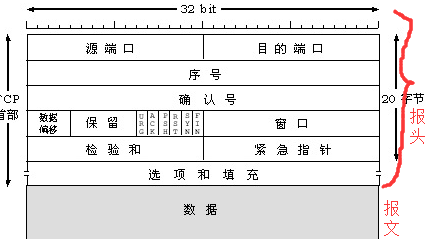
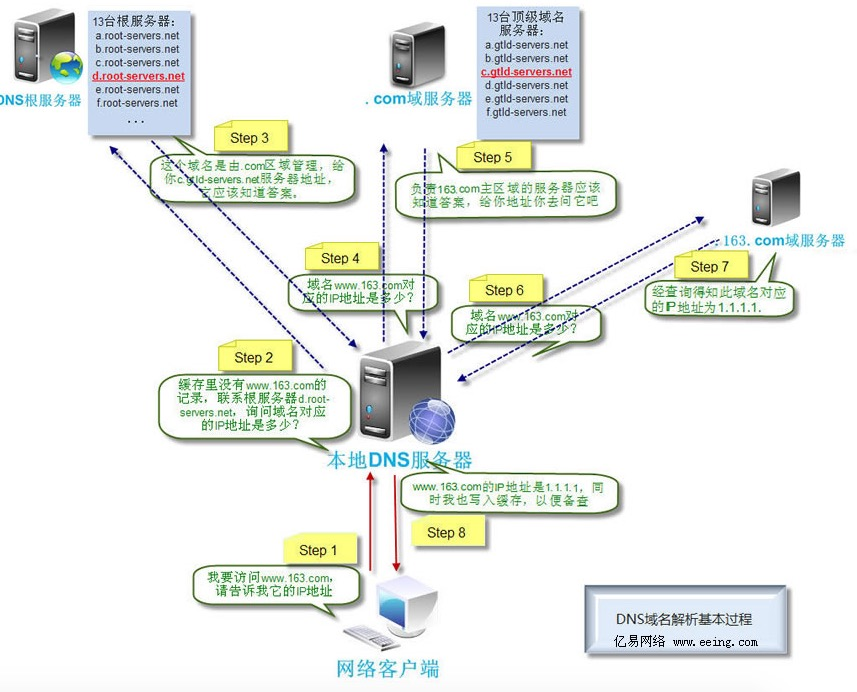

光猫是一种调制解调器，是光调制解调器，主要作用是将光信号转化为电信号，如果入户线是光纤的，那么需要光猫来将光信号转换为电信号，然后连接路由器，其他终端设备连接路由器来上网，很多光猫也带有路由器的功能，但是一般不太好用，所以一般都是建议光猫和路由器一起来使用，各司其职。 如果入户线不是光纤，那么只要有个路由器就可以直接上网了

### 集线器大致原理

    为每台电脑进行了标记（mac地址，全球唯一）6位16进制代码。
    集线器的工作方式为广播，将接收到的信息进行群发。
    MAC地址可查：（也可以从ipconfig /all中查看）
    IP地址划分区域（0.0.0.0---255.255.255.255，二进制，2的八次方，总共有2的三十二次方）
    交换机的DHCP-自动给连接到其的计算机分发IP地址，划分广播域（类似subnet）
    路由器去管理交换机，实现不同广播域的交互（使用IP地址查询）。
    发送请求时，其中包含目标/自己的IP，以及mac地址。有了IP地址，就不走广播，交换机上的arp协议（协议：数据格式）会发送arp广播包，收到此广播包的计算机将会把mac，IP地址返回交换机，以此避免广播风暴
    IPV6的网络地址为8位十六进制数
    IANA机构，负责分发IP地址。

### 通信流程

    IP地址：0.0.0.0 -- 255.255.255.255 中分配了 192.168.x.x
    公网IP
    私网IP 198.168.x.x
    NAT网络地址转换：将内网的私网IP转为公网IP
    当私网的一台设备发送到www.baidu.com的请求，首先要经过DNS解析，将域名（好记）解析为百度服务器的IP地址（公网IP）
    NAT网络地址转换：
        数据包：
            - 目标IP：百度地址
            源IP：无法使用内网IP，只能找路由器的公网IP，但是会记录下私网IP。
            - Target port
    该请求会经过多过路由跳转，直到找到对应的百度的路由器，路由往路由通信，使用了路由协议，路由计算会计算最佳跳转路径。

    举例：从A计算机给B计算机在京东APP上发送消息，B计算机如何正确的在京东APP中受到信息？
    计算机会给每个需要网络的程序程序配置端口号（0-65535）
    根据收到的数据包，路由器进行端口映射
    80：198.168.12.11，映射到路由器下的一个主机上。
    根据数据包中源主机的信息，精准返回信息。并列路由器上会记录下京东的IP地址，方便未来使用。

    

## OSI 7层模型
互联网协议按照功能不同分为osi七层或tcp/ip五层或tcp/ip四层：

### 物理层
物理层 ：解决信号转换的问题，基本都是数字信号，二进制数据控制的电路信号、电磁信号：电信号、光纤(光信号：光纤网卡可以将电信号转换为光信号)、电磁波。这个基本不需要我们关注，设备厂商就帮我们解决了。

### 数据链接层

    mac地址主要是用来解决网络通信的目标问题的，可以让信号传输的时候找到正确的网卡，不会把数据发乱目标。

    数据链路层由来：单纯的电信号0和1没有任何意义，必须规定电信号多少位一组，每组什么意思
    数据链路层的功能：定义了电信号的分组方式
    以太网协议（早期）：早期的时候各个公司都有自己的分组方式，后来形成了统一的标准，即以太网协议ethernet
    · 一组电信号构成一个数据包，叫做‘帧’
    · 每一数据帧分成：报头head和data两部分
    head包含：(固定18个字节)
        发送者／源地址，6个字节
        接收者／目标地址，6个字节
        数据类型，6个字节
    data包含：(最短46字节，最长1500字节) 

    数据包的具体内容
    　　　　head长度＋data长度＝最短64字节，最长1518字节，超过最限制就分片发送。

    MAC地址：
        head中包含的源和目标地址由来：ethernet规定接入internet的设备都必须具备网卡，发送端和接收端的地址便是指网卡的地址，即mac地址

        mac地址：每块网卡出厂时都被烧制上一个世界唯一的mac地址，长度为48位2进制，通常由12位16进制数表示（前六位是厂商编号，后六位是流水线号）

    广播：
        有了mac地址，同一网络内的两台主机就可以通信了（一台主机通过arp协议获取另外一台主机的mac地址）

        ethernet（以太网）采用最原始的方式，广播的方式进行通信，即计算机通信基本靠吼

### 网络层
    网络层由来：有了ethernet、mac地址、广播的发送方式，世界上的计算机就可以彼此通信了，问题是世界范围的互联网是由

    一个个彼此隔离的小的局域网组成的，那么如果所有的通信都采用以太网的广播方式，那么一台机器发送的包全世界都会收到，

    这就不仅仅是效率低的问题了，这会是一种灾难

    上图结论：必须找出一种方法来区分哪些计算机属于同一广播域，哪些不是。如果是就采用广播的方式发送，如果不是，就采用路由的方式（向不同广播域／子网分发数据包），mac地址是无法区分的，它只跟厂商有关。
    网络层功能：引入一套新的地址用来区分不同的广播域／子网，这套地址即网络地址

    IP协议：
    · 规定网络地址的协议叫ip协议，它定义的地址称之为ip地址，广泛采用的v4版本即ipv4，它规定网络地址由32位2进制表示
    · 范围0.0.0.0-255.255.255.255 (4个点分十进制，也就是4个8位二进制数)
    · 一个ip地址通常写成四段十进制数，例：172.16.10.1

    ipv6，通过上面可以看出，ip紧缺，所以为了满足更多ip需要，出现了ipv6协议：6个冒号分割的16进制数表示，这个应该是将来的趋势，但是ipv4还是用的最多的，因为我们一般一个公司就一个对外的IP地址，我们所有的机器上网都走这一个IP出口。

    ip地址分成两部分

    网络部分：标识子网
    主机部分：标识主机
    　注意：单纯的ip地址段只是标识了ip地址的种类，从网络部分或主机部分都无法辨识一个ip所处的子网

　　例：172.16.10.1与172.16.10.2并不能确定二者处于同一子网

    子网掩码：
    所谓”子网掩码”，就是表示子网络特征的一个参数。它在形式上等同于IP地址，也是一个32位二进制数字，它的网络部分全部为1，主机部分全部为0。比如，IP地址172.16.10.1，如果已知网络部分是前24位，主机部分是后8位，那么子网络掩码就是11111111.11111111.11111111.00000000，写成十进制就是255.255.255.0。
    知道”子网掩码”，我们就能判断，任意两个IP地址是否处在同一个子网络。方法是将两个IP地址与子网掩码分别进行AND运算（两个数位都为1，运算结果为1，否则为0），然后比较结果是否相同，如果是的话，就表明它们在同一个子网络中，否则就不是。

    比如，已知IP地址172.16.10.1和172.16.10.2的子网掩码都是255.255.255.0，请问它们是否在同一个子网络？两者与子网掩码分别进行AND运算，

    　　172.16.10.1：10101100.00010000.00001010.000000001

    　　255255.255.255.0:11111111.11111111.11111111.00000000

    　　AND运算得网络地址结果：10101100.00010000.00001010.000000001->172.16.10.0

    

    　　172.16.10.2：10101100.00010000.00001010.000000010

    　　255.255.255.0:11111111.11111111.11111111.00000000

    　　AND运算得网络地址结果：10101100.00010000.00001010.000000001->172.16.10.0

    　　结果都是172.16.10.0，因此它们在同一个子网络。

    　　ip地址与子网掩码 按位与 得到网段地址

    ip数据包：
    ip数据包也分为head和data部分，无须为ip包定义单独的栏位，直接放入以太网包的data部分
    head：长度为20到60字节
    data：最长为65,515字节。

    　　而以太网数据包的”数据”部分，最长只有1500字节。因此，如果IP数据包超过了1500字节， 它就需要分割成几个以太网数据包，分开发送了。

    ARP（Address Resolution Protocol) 协议：
    　arp协议由来：计算机通信基本靠吼，即广播的方式，所有上层的包到最后都要封装上以太网头，然后通过以太网协议发送，在谈及以太网协议时候，我门了解到

    通信是基于mac的广播方式实现，计算机在发包时，获取自身的mac是容易的，如何获取标主机的mac，就需要通过arp协议
    arp协议功能：广播的方式发送数据包，获取目标主机的mac地址

    地址解析协议，即ARP（Address Resolution Protocol），是根据IP地址获取物理地址的一个TCP/IP协议。
    　　主机发送信息时将包含目标IP地址的ARP请求广播到网络上的所有主机，并接收返回消息，以此确定目标的物理地址。收到返回消息后将该IP地址和物理地址存入本机ARP缓存中并保留一定时间，下次请求时直接查询ARP缓存以节约资源。地址解析协议是建立在网络中各个主机互相信任的基础上的，网络上的主机可以自主发送ARP应答消息，其他主机收到应答报文时不会检测该报文的真实性就会将其记入本机ARP缓存；由此攻击者就可以向某一主机发送伪ARP应答报文，使其发送的信息无法到达预期的主机或到达错误的主机，这就构成了一个ARP欺骗。ARP命令可用于查询本机ARP缓存中IP地址和MAC地址的对应关系、添加或删除静态对应关系等。相关协议有RARP、代理ARP。NDP用于在IPv6中代替地址解析协议。 

    协议工作方式：每台主机ip都是已知的（我只知道我的局域网ip地址，要给一个非同一网络的我不知道ip地址的电脑发消息，怎么办：NET穿透）

　　　例如：主机172.16.10.10/24访问172.16.10.11/24

　　一：首先通过ip地址和子网掩码区分出自己所处的子网

    场景	数据包地址
    同一子网	目标主机mac，目标主机ip
    不同子网	网关mac，目标主机ip

    二：分析172.16.10.10/24与172.16.10.11/24处于同一网络(如果不是同一网络，那么下表中目标ip为172.16.10.1,通过arp获取的是网关的mac)

     	源mac	目标mac	源ip	目标ip	数据部分
    发送端主机	发送端mac	FF:FF:FF:FF:FF:FF	172.16.10.10/24	172.16.10.11/24	数据

    三：这个包会以广播的方式在发送端所处的子网内传输，所有主机接收后拆开包，发现目标ip为自己的，就响应，返回自己的mac

    2.3.4 传输层
    传输层的由来：网络层的ip帮我们区分子网，以太网层的mac帮我们找到主机吗，但是只找到主机有用吗，是不是程序之间进行的沟通啊像QQ、浏览器和京东服务器，然后大家使用的都是应用程序，你的电脑上可能同时开启qq，暴风影音，等多个应用程序，
    
    那么我们通过ip和mac找到了一台特定的主机，如何标识这台主机上的应用程序，答案就是端口，端口即应用程序与网卡关联的编号。

    传输层功能：建立端口到端口的通信(端对端通信)

    127.0.0.1就是你本机程序之间进行通信的地址，就是自己玩自己，不和别人玩，这叫做本机的回环地址，我们测试的时候自己模拟客户端和服务端

    根据用途和安全性级别的不同，IP地址还可以大致分为两类：公共地址和私有地址。公用地址在Internet中使用，可以在Internet中随意访问。私有地址只能在内部网络中使用，只有通过代理服务器才能与Internet通信。 

    一个机构网络要连入Internet，必须申请公用IP地址。但是考虑到网络安全和内部实验等特殊情况，在IP地址中专门保留了三个区域作为私有地址，其地址范围如下： 

    网络类别
    1. A类网络​​
        ​​地址范围​​：1.0.0.0 到 126.255.255.255。
        第一个字节为​​网络号​​（取值范围1-126），后三个字节为主机号。
        ​​注意​​：0和127为保留地址（如127.0.0.1用于本地环回测试）。
        ​​默认子网掩码​​：255.0.0.0。
        ​​特点​​：
        网络数量少（仅126个），但每个网络可容纳约1677万台主机。
        适用于政府机构、大型企业等需要海量主机连接的场景

    2. B类网络​​
        ​​地址范围​​：128.0.0.0 到 191.255.255.255。
        前两个字节为​​网络号​​（第一个字节范围128-191），后两个字节为主机号。
        ​​默认子网掩码​​：255.255.0.0。
        ​​特点​​：
        网络数量中等（约1.6万个），每个网络可容纳约6.5万台主机。
        适合中型网络，如大学校园网或中型企业

    ​3. C类网络​​
        ​​地址范围​​：192.0.0.0 到 223.255.255.255。
        前三个字节为​​网络号​​（第一个字节范围192-223），最后一个字节为主机号。
        ​​默认子网掩码​​：255.255.255.0。
        ​​特点​​：
        网络数量多（约209万个），但每个网络仅支持254台主机。
        主要用于小型网络，如家庭、办公室或部门级局域网。

    使用保留地址的网络只能在内部进行通信，而不能与其他网络互连。因为本网络中的保留地址同样也可能被其它网络使用，如果进行网络互连，那么寻找路由时就会因为地址的不唯一而出现问题。但是这些使用保留地址的网络可以通过将本网络内的保留地址翻译转换成公共地址的方式实现与外部网络的互连。这也是保证网络安全的重要方法之一。 

特殊IP地址(保留IP地址)介绍：
    一、0.0.0.0 

    严格说来，0.0.0.0已经不是一个真正意义上的IP地址了。它表示的是这样一个集合：所有不清楚的主机和目的网络。这里的“不清楚”是指在本机的路由表里没有特定条目指明如何到达。对本机来说，它就是一个“收容所”，所有不认识的“三无”人员，一 律送进去。如果你在网络设置中设置了缺省网关，那么Windows系统会自动产生一个目的地址为0.0.0.0的缺省路由。 

    二、255.255.255.255 

    限制广播地址。对本机来说，这个地址指本网段内(同一广播域)的所有主机。如果翻译成人类的语言，应该是这样：“这个房间里的所有人都注意了！”这个地址不能被路由器转发。 

    三、127.0.0.1 

    本机地址，主要用于测试。用汉语表示，就是“我自己”。在Windows系统中，这个地址有一个别名“Localhost”。寻址这样一个地址，是不能把它发到网络接口的。除非出错，否则在传输介质上永远不应该出现目的地址为“127.0.0.1”的 数据包。 

    四、224.0.0.1 

    组播地址，注意它和广播的区别。从224.0.0.0到239.255.255.255都是这样的地址。224.0.0.1特指所有主机，224.0.0.2特指所有路由器。这样的地址多用于一些特定的程序以及多媒体程序。如果你的主机开启了IRDP (Internet路由发现协议，使用组播功能)功能，那么你的主机路由表中应该有这样一条路由。 

    五、169.254.x.x 

    如果你的主机使用了DHCP功能自动获得一个IP地址，那么当你的DHCP服务器发生故障，或响应时间太长而超出了一个系统规定的时间，Wingdows系统会为你分配这样一个地址。如果你发现你的主机IP地址是一个诸如此类的地址，很不幸，十有八九 是你的网络不能正常运行了。 

    六、10.x.x.x、172.16。x。x～172.31。x。x、192.168。x。x 

    私有地址，这些地址被大量用于企业内部网络中。一些宽带路由器，也往往使用192.168.1.1作为缺省地址。私有网络由于不与外部互连，因而可能使用随意的IP地址。保留这样的地址供其使用是为了避免以后接入公网时引起地址混乱。使用私有地址的私 有网络在接入Internet时，要使用地址翻译(NAT)，将私有地址翻译成公用合法地址。在Internet上，这类地址是不能出现的。 

    对一台网络上的主机来说，它可以正常接收的合法目的网络地址有三种：本机的IP地址、广播地址以及组播地址。

    2.3.5 应用层
    应用层由来：用户使用的都是应用程序，均工作于应用层，互联网是开发的，大家都可以开发自己的应用程序，数据多种多样，必须规定好数据的组织形式 

    应用层功能：规定应用程序的数据格式。

    例：TCP协议可以为各种各样的程序传递数据，比如Email、WWW、FTP等等。那么，必须有不同协议规定电子邮件、网页、FTP数据的格式，这些应用程序协议就构成了”应用层”。

## 重点： TCP协议：
    tcp协议：(TCP把连接作为最基本的对象，每一条TCP连接都有两个端点，这种端点我们叫作套接字（socket），它的定义为端口号拼接到IP地址即构成了套接字，例如，若IP地址为192.3.4.16 而端口号为80，那么得到的套接字为192.3.4.16:80。)

    　　当应用程序希望通过 TCP 与另一个应用程序通信时，它会发送一个通信请求。这个请求必须被送到一个确切的地址。在双方“握手”之后，TCP 将在两个应用程序之间建立一个全双工 (full-duplex，双方都可以收发消息) 的通信。

    　　这个全双工的通信将占用两个计算机之间的通信线路，直到它被一方或双方关闭为止。

    　　它是可靠传输，TCP数据包没有长度限制，理论上可以无限长，但是为了保证网络的效率，通常TCP数据包的长度不会超过IP数据包的长度，以确保单个TCP数据包不必再分割。

    一、TCP与IP的分工协作
    ​​IP层的核心作用​​
    IP协议负责​​网络层的路由与寻址​​，其数据包（IP数据报）包含源IP地址、目的IP地址、TTL（生存时间）等字段，确保数据包能通过不同网络路径传输。
    ​​IP数据包的数据部分（Payload）承载传输层协议内容​​，如TCP段、UDP数据报或ICMP消息。
    ​​TCP层的核心作用​​
    TCP协议位于​​传输层​​，负责​​端到端的可靠传输​​，包括数据分段、排序、重传、流量控制等。
    ​​TCP数据包（TCP段）作为IP数据包的载荷​​，包含源端口、目的端口、序列号、确认号等信息，确保应用程序间的有序通信

    二、封装过程与数据流向
    ​1.​发送端的封装流程​​
    ​​应用层​​生成数据（如HTTP请求）→ ​​传输层​​将数据封装为TCP段（添加TCP头部）→ ​​网络层​​将TCP段封装为IP数据包（添加IP头部）→ ​​链路层​​添加MAC地址等物理层信息。
    例如：一个网页请求的TCP段会被IP层包裹后，通过路由器逐跳转发到目标服务器。
    ​​2.接收端的解封装流程​​
    ​​链路层​​剥离物理帧头→ ​​网络层​​校验IP头部并提取TCP段→ ​​传输层​​根据TCP头部重组数据→ ​​应用层​​获取最终数据

    是的，​​TCP数据包是封装在IP数据包中的​​，两者的关系是分层嵌套的。具体原理如下：

    三、关键技术验证
    ​​IP与TCP头部的独立性​​
    IP头部和TCP头部是​​连续但独立的结构​​。例如，IP头部中的“协议”字段（如值为6）明确指示载荷为TCP段，接收方据此将数据传递给TCP层处理。
    ​​分片与重组机制​​
    当TCP段长度超过网络MTU（如1500字节）时，IP层会将TCP段​​分片为多个IP数据包​​传输，每个分片独立封装IP头部，目标主机重组后还原完整的TCP段。
    ​​校验与可靠性​​
    IP层仅校验头部完整性（通过校验和），而TCP层负责数据内容的校验（如序列号、确认应答），确保端到端可靠性。

    [Ethernet head [ip head [tcp head [data]]]]

    udp协议：不可靠传输，”报头”部分一共只有8个字节，总长度不超过65,535字节，正好放进一个IP数据包。         

    TCP---传输控制协议,提供的是面向连接、可靠的字节流服务。当客户和服务器彼此交换数据前，必须先在双方之间建立一个TCP连接，之后才能传输数据。TCP提供超时重发，丢弃重复数据，检验数据，流量控制等功能，保证数据能从一端传到另一端。 
    UDP---用户数据报协议，是一个简单的面向数据报的运输层协议。UDP不提供可靠性，它只是把应用程序传给IP层的数据报发送出去，但是并不能保证它们能到达目的地。由于UDP在传输数据报前不用在客户和服务器之间建立一个连接，且没有超时重发等机制，故而传输速度很快

    现在Internet上流行的协议是TCP/IP协议，该协议中对低于1024的端口都有确切的定义，他们对应着Internet上一些常见的服务。这些常见的服务可以分为使用TCP端口（面向连接）和使用UDP端口（面向无连接）两种。 

    说到TCP和UDP,首先要明白“连接”和“无连接”的含义，他们的关系可以用一个形象地比喻来说明，就是打电话和写信。两个人如果要通话，首先要建立连接——即打电话时的拨号，等待响应后——即接听电话后，才能相互传递信息，最后还要断开连接——即挂电话。写信就比较简单了，填写好收信人的地址后将信投入邮筒，收信人就可以收到了。从这个分析可以看出，建立连接可以在需要痛心地双方建立一个传递信息的通道，在发送方发送请求连接信息接收方响应后，由于是在接受方响应后才开始传递信息，而且是在一个通道中传送，因此接受方能比较完整地收到发送方发出的信息，即信息传递的可靠性比较高。但也正因为需要建立连接，使资源开销加大（在建立连接前必须等待接受方响应，传输信息过程中必须确认信息是否传到及断开连接时发出相应的信号等），独占一个通道，在断开连接钱不能建立另一个连接，即两人在通话过程中第三方不能打入电话。而无连接是一开始就发送信息（严格说来，这是没有开始、结束的），只是一次性的传递，是先不需要接受方的响应，因而在一定程度上也无法保证信息传递的可靠性了，就像写信一样，我们只是将信寄出去，却不能保证收信人一定可以收到。 
    TCP是面向连接的，有比较高的可靠性， 一些要求比较高的服务一般使用这个协议，如FTP、Telnet、SMTP、HTTP、POP3等。
    而UDP是面向无连接的，使用这个协议的常见服务有DNS、SNMP、QQ等。对于QQ必须另外说明一下，QQ2003以前是只使用UDP协议的，其服务器使用8000端口，侦听是否有信息传来，客户端使用4000端口，向外发送信息（这也就不难理解在一般的显IP的QQ版本中显示好友的IP地址信息中端口常为4000或其后续端口的原因了），即QQ程序既接受服务又提供服务，在以后的QQ版本中也支持使用TCP协议了。
    

TCP 报文：

源端口和目的端口，各占2个字节，分别写入源端口和目的端口；
 2 序号，占4个字节，TCP连接中传送的字节流中的每个字节都按顺序编号。例如，一段报文的序号字段值是 301 ，而携带的数据共有100字段，显然下一个报文段（如果还有的话）的数据序号应该从401开始；
 3 确认号，占4个字节，是期望收到对方下一个报文的第一个数据字节的序号。例如，B收到了A发送过来的报文，其序列号字段是501，而数据长度是200字节，这表明B正确的收到了A发送的到序号700为止的数据。因此，B期望收到A的下一个数据序号是701，于是B在发送给A的确认报文段中把确认号置为701；
 4 数据偏移，占4位，它指出TCP报文的数据距离TCP报文段的起始处有多远；
 5 保留，占6位，保留今后使用，但目前应都位0；
 6 紧急URG，当URG=1，表明紧急指针字段有效。告诉系统此报文段中有紧急数据；
 7 确认ACK，仅当ACK=1时，确认号字段才有效。TCP规定，在连接建立后所有报文的传输都必须把ACK置1；
 8 推送PSH，当两个应用进程进行交互式通信时，有时在一端的应用进程希望在键入一个命令后立即就能收到对方的响应，这时候就将PSH=1；
 9 复位RST，当RST=1，表明TCP连接中出现严重差错，必须释放连接，然后再重新建立连接；
10 同步SYN，在连接建立时用来同步序号。当SYN=1，ACK=0，表明是连接请求报文，若同意连接，则响应报文中应该使SYN=1，ACK=1；
11 终止FIN，用来释放连接。当FIN=1，表明此报文的发送方的数据已经发送完毕，并且要求释放；
12 窗口，占2字节，指的是通知接收方，发送本报文你需要有多大的空间来接受；
13 检验和，占2字节，校验首部和数据这两部分；
14 紧急指针，占2字节，指出本报文段中的紧急数据的字节数；
15 选项，长度可变，定义一些其他的可选的参数。

## TCP三次握手和四次挥手
    我们知道网络层，可以实现两个主机之间的通信。但是这并不具体，因为，真正进行通信的实体是在主机中的进程，是一个主机中的一个进程与另外一个主机中的一个进程在交换数据。IP协议虽然能把数据报文送到目的主机，但是并没有交付给主机的具体应用进程。而端到端的通信才应该是应用进程之间的通信。

    UDP，在传送数据前不需要先建立连接，远地的主机在收到UDP报文后也不需要给出任何确认。虽然UDP不提供可靠交付，但是正是因为这样，省去和很多的开销，使得它的速度比较快，比如一些对实时性要求较高的服务，就常常使用的是UDP。对应的应用层的协议主要有 DNS,TFTP,DHCP,SNMP,NFS 等。

    TCP，提供面向连接的服务，在传送数据之前必须先建立连接，数据传送完成后要释放连接。因此TCP是一种可靠的的运输服务，但是正因为这样，不可避免的增加了许多的开销，比如确认，流量控制等。对应的应用层的协议主要有 SMTP,TELNET,HTTP,FTP 等。

常用的端口号：

三次握手：

1. TCP服务器进程先创建传输控制块TCB（Transmission Control Block)，时刻准备接受客户进程的连接请求，此时服务器就进入了LISTEN（监听）状态；
2. TCP客户进程也是先创建传输控制块TCB，然后向服务器发出连接请求报文，这是报文首部中的同部位SYN=1，同时选择一个初始序列号 seq=x ，此时，TCP客户端进程进入了 SYN-SENT（同步已发送状态）状态。TCP规定，SYN报文段（SYN=1的报文段）不能携带数据，但需要消耗掉一个序号。
3. TCP服务器收到请求报文后，如果同意连接，则发出确认报文。确认报文中应该 ACK=1，SYN=1，确认号是ack=x+1，同时也要为自己初始化一个序列号 seq=y，此时，TCP服务器进程进入了SYN-RCVD（同步收到）状态。这个报文也不能携带数据，但是同样要消耗一个序号。
4. TCP客户进程收到确认后，还要向服务器给出确认。确认报文的ACK=1，ack=y+1，自己的序列号seq=x+1，此时，TCP连接建立，客户端进入ESTABLISHED（已建立连接）状态。TCP规定，ACK报文段可以携带数据，但是如果不携带数据则不消耗序号。
5. 当服务器收到客户端的确认后也进入ESTABLISHED状态，此后双方就可以开始通信了。 

根据您的描述，流程中存在​​两处关键错误​​，以下是对TCP三次握手正确流程的详细解析与修正：

​​一、TCP三次握手标准流程​​
    1. ​​第一次握手（SYN）​​
        ​​客户端行为​​：发送SYN=1的报文，携带​​初始序列号x​​，进入SYN-SENT状态。
        ​​服务器状态​​：监听端口，尚未回应。
        ​​关键字段​​：SYN=1、Seq=x。
    ​2. ​第二次握手（SYN+ACK）​​
        ​​服务器行为​​：收到客户端SYN后，发送SYN=1和ACK=1的报文，携带​​服务器初始序列号y​​，并将​​确认号设为x+1​​（表示已收到客户端SYN），进入SYN-RECEIVED（或SYN-RCVD）状态。
   
    ​3. ​第三次握手（ACK）​​
        ​​客户端行为​​：发送ACK=1的报文，​​确认号设为y+1​​（表示已收到服务器SYN），序列号更新为x+1（初始序列号+1），进入ESTABLISHED状态。
        ​​服务器行为​​：收到ACK后，确认号更新为y+1，服务器也进入ESTABLISHED状态，连接建立完成。服务器的初始序列号y已在第二次握手时确定，后续数据传输中序列号将基于y逐步累加，但第三次握手本身不涉及服务器发送新数据，因此序列号保持不变。

TCP客户端还要发送一次确认的原因：
主要防止已经失效的连接请求报文突然又传送到了服务器，从而产生错误。

如果使用的是两次握手建立连接，假设有这样一种场景，客户端发送了第一个请求连接并且没有丢失，只是因为在网络结点中滞留的时间太长了，由于TCP的客户端迟迟没有收到确认报文，以为服务器没有收到，此时重新向服务器发送这条报文，此后客户端和服务器经过两次握手完成连接，传输数据，然后关闭连接。此时此前滞留的那一次请求连接，网络通畅了到达了服务器，这个报文本该是失效的，但是，两次握手的机制将会让客户端和服务器再次建立连接，这将导致不必要的错误和资源的浪费。

如果采用的是三次握手，就算是那一次失效的报文传送过来了，服务端接受到了那条失效报文并且回复了确认报文，但是客户端不会再次发出确认。由于服务器收不到确认，就知道客户端并没有请求连接。

四次挥手：
1. 数据传输完毕后，双方都可释放连接。最开始的时候，客户端和服务器都是处于ESTABLISHED状态，然后客户端主动关闭，服务器被动关闭。服务端也可以主动关闭，一个流程。

2. 客户端进程发出连接释放报文，并且停止发送数据。释放数据报文首部，FIN=1，其序列号为seq=u（等于前面已经传送过来的数据的最后一个字节的序号加1），此时，客户端进入FIN-WAIT-1（终止等待1）状态。 TCP规定，FIN报文段即使不携带数据，也要消耗一个序号。
服务器收到连接释放报文，发出确认报文，ACK=1，ack=u+1，并且带上自己的序列号seq=v，此时，服务端就进入了CLOSE-WAIT（关闭等待）状态。TCP服务器通知高层的应用进程，客户端向服务器的方向就释放了，这时候处于半关闭状态，即客户端已经没有数据要发送了，但是服务器若发送数据，客户端依然要接受。这个状态还要持续一段时间，也就是整个CLOSE-WAIT状态持续的时间。
3. 客户端收到服务器的确认请求后，此时，客户端就进入FIN-WAIT-2（终止等待2）状态，等待服务器发送连接释放报文（在这之前还需要接受服务器发送的最后的数据）。

4. 服务器将最后的数据发送完毕后，就向客户端发送连接释放报文，FIN=1，ack=u+1，由于在半关闭状态，服务器很可能又发送了一些数据，假定此时的序列号为seq=w，此时，服务器就进入了LAST-ACK（最后确认）状态，等待客户端的确认。

5. 客户端收到服务器的连接释放报文后，必须发出确认，ACK=1，ack=w+1，而自己的序列号是seq=u+1，此时，客户端就进入了TIME-WAIT（时间等待）状态。注意此时TCP连接还没有释放，必须经过2∗∗MSL（最长报文段寿命）的时间后，当客户端撤销相应的TCB后，才进入CLOSED状态。

6. 服务器只要收到了客户端发出的确认，立即进入CLOSED状态。同样，撤销TCB后，就结束了这次的TCP连接。可以看到，服务器结束TCP连接的时间要比客户端早一些。

第一，保证客户端发送的最后一个ACK报文能够到达服务器，因为这个ACK报文可能丢失，站在服务器的角度看来，我已经发送了FIN+ACK报文请求断开了，客户端还没有给我回应，应该是我发送的请求断开报文它没有收到，于是服务器又会重新发送一次，而客户端就能在这个2MSL时间段内收到这个重传的报文，接着给出回应报文，并且会重启2MSL计时器。

第二，防止类似与“三次握手”中提到了的“已经失效的连接请求报文段”出现在本连接中。客户端发送完最后一个确认报文后，在这个2MSL时间中，就可以使本连接持续的时间内所产生的所有报文段都从网络中消失。这样新的连接中不会出现旧连接的请求报文。

为什么建立连接是三次握手，关闭连接确是四次挥手呢？

建立连接的时候， 服务器在LISTEN状态下，收到建立连接请求的SYN报文后，把ACK和SYN放在一个报文里发送给客户端。 
而关闭连接时，服务器收到对方的FIN报文时，仅仅表示对方不再发送数据了但是还能接收数据，而自己也未必全部数据都发送给对方了，所以己方可以立即关闭，也可以发送一些数据给对方后，再发送FIN报文给对方来表示同意现在关闭连接，因此，己方ACK和FIN一般都会分开发送，从而导致多了一次。

如果已经建立了连接，但是客户端突然出现故障了怎么办？
    TCP还设有一个保活计时器，显然，客户端如果出现故障，服务器不能一直等下去，白白浪费资源。服务器每收到一次客户端的请求后都会重新复位这个计时器，时间通常是设置为2小时，若两小时还没有收到客户端的任何数据，服务器就会发送一个探测报文段，以后每隔75分钟发送一次。若一连发送10个探测报文仍然没反应，服务器就认为客户端出了故障，接着就关闭连接。 

 

 ### 2.3.6 socket
 我们知道两个进程如果需要进行通讯最基本的一个前提能能够唯一的标示一个进程，在本地进程通讯中我们可以使用PID来唯一标示一个进程，但PID只在本地唯一，网络中的两个进程PID冲突几率很大，这时候我们需要另辟它径了，我们知道IP层的ip地址可以唯一标示主机，而TCP层协议和端口号可以唯一标示主机的一个进程，这样我们可以利用ip地址＋协议＋端口号唯一标示网络中的一个进程。

　　　　能够唯一标示网络中的进程后，它们就可以利用socket进行通信了，什么是socket呢？我们经常把socket翻译为套接字，socket是在应用层和传输层之间的一个抽象层，它把TCP/IP层复杂的操作抽象为几个简单的接口供应用层调用已实现进程在网络中通信。

# 三、网络通信的实现
　想实现网络通信，每台主机需具备四要素

本机的IP地址
子网掩码
网关的IP地址
DNS的IP地址
　　获取这四要素分两种方式
　　　　1.静态获取：即手动配置

　　　　2.动态获取：通过dhcp获取

（1）最前面的”以太网标头”，设置发出方（本机）的MAC地址和接收方（DHCP服务器）的MAC地址。前者就是本机网卡的MAC地址，后者这时不知道，就填入一个广播地址：FF-FF-FF-FF-FF-FF。

　（2）后面的”IP标头”，设置发出方的IP地址和接收方的IP地址。这时，对于这两者，本机都不知道。于是，发出方的IP地址就设为0.0.0.0，接收方的IP地址设为255.255.255.255。

　（3）最后的”UDP标头”，设置发出方的端口和接收方的端口。这一部分是DHCP协议规定好的，发出方是68端口，接收方是67端口。
这个数据包构造完成后，就可以发出了。以太网是广播发送，同一个子网络的每台计算机都收到了这个包。因为接收方的MAC地址是FF-FF-FF-FF-FF-FF，看不出是发给谁的，所以每台收到这个包的计算机，还必须分析这个包的IP地址，才能确定是不是发给自己的。当看到发出方IP地址是0.0.0.0，接收方是255.255.255.255，于是DHCP服务器知道”这个包是发给我的”，而其他计算机就可以丢弃这个包。

 

接下来，DHCP服务器读出这个包的数据内容，分配好IP地址，发送回去一个”DHCP响应”数据包。这个响应包的结构也是类似的，以太网标头的MAC地址是双方的网卡地址，IP标头的IP地址是DHCP服务器的IP地址（发出方）和255.255.255.255（接收方），UDP标头的端口是67（发出方）和68（接收方），分配给请求端的IP地址和本网络的具体参数则包含在Data部分。

新加入的计算机收到这个响应包，于是就知道了自己的IP地址、子网掩码、网关地址、DNS服务器等等参数

# 四、结合协议看网络通信流程：
    1.本机获取

    本机的IP地址：192.168.1.100
    子网掩码：255.255.255.0
    网关的IP地址：192.168.1.1
    DNS的IP地址：8.8.8.8
    2.打开浏览器，想要访问Google，在地址栏输入了网址：www.google.com。

    3.dns协议(基于udp协议)

    域名定义：http://jingyan.baidu.com/article/1974b289a649daf4b1f774cb.html

    顶级域名：以.com,.net,.org,.cn等等属于国际顶级域名，根据目前的国际互联网域名体系，国际顶级域名分为两类：类别顶级域名(gTLD)和地理顶级域名(ccTLD)两种。类别顶级域名是以"COM"、"NET"、"ORG"、"BIZ"、"INFO"等结尾的域名，均由国外公司负责管理。地理顶级域名是以国家或地区代码为结尾的域名，如"CN"代表中国，"UK"代表英国。地理顶级域名一般由各个国家或地区负责管理。

    　二级域名：二级域名是以顶级域名为基础的地理域名，比喻中国的二级域有，.com.cn,.net.cn,.org.cn,.gd.cn等.子域名是其父域名的子域名，比喻父域名是abc.com,子域名就是www.abc.com或者*.abc.com.
    　　一般来说，二级域名是域名的一条记录，比如alidiedie.com是一个域名，www.alidiedie.com是其中比较常用的记录，一般默认是用这个，但是类似*.alidiedie.com的域名全部称作是alidiedie.com的二级

    4. HTTP部分的内容，类似于下面这样：

    GET / HTTP/1.1
    Host: www.google.com
    Connection: keep-alive
    User-Agent: Mozilla/5.0 (Windows NT 6.1) ……
    Accept: text/html,application/xhtml+xml,application/xml;q=0.9,*/*;q=0.8
    Accept-Encoding: gzip,deflate,sdch
    Accept-Language: zh-CN,zh;q=0.8
    Accept-Charset: GBK,utf-8;q=0.7,*;q=0.3
    Cookie: … …
    我们假定这个部分的长度为4960字节，它会被嵌在TCP数据包之中。‘

    5.TCP协议：
    TCP数据包需要设置端口，接收方（Google）的HTTP端口默认是80，发送方（本机）的端口是一个随机生成的1024-65535之间的整数，假定为51775。
    TCP数据包的标头长度为20字节，加上嵌入HTTP的数据包，总长度变为4980字节。

    6.IP协议
    然后，TCP数据包再嵌入IP数据包。IP数据包需要设置双方的IP地址，这是已知的，发送方是192.168.1.100（本机），接收方是172.194.72.105（Google）。

    IP数据包的标头长度为20字节，加上嵌入的TCP数据包，总长度变为5000字节。

    7.以太网协议
    最后，IP数据包嵌入以太网数据包。以太网数据包需要设置双方的MAC地址，发送方为本机的网卡MAC地址，接收方为网关192.168.1.1的MAC地址（通过ARP协议得到）。

    太网数据包的数据部分，最大长度为1500字节，而现在的IP数据包长度为5000字节。因此，IP数据包必须分割成四个包。因为每个包都有自己的IP标头（20字节），所以四个包的IP数据包的长度分别为1500、1500、1500、560。

    

    8.服务器端响应
    经过多个网关的转发，Google的服务器172.194.72.105，收到了这四个以太网数据包。

    根据IP标头的序号，Google将四个包拼起来，取出完整的TCP数据包，然后读出里面的”HTTP请求”，接着做出”HTTP响应”，再用TCP协议发回来。

    本机收到HTTP响应以后，就可以将网页显示出来，完成一次网络通信。

